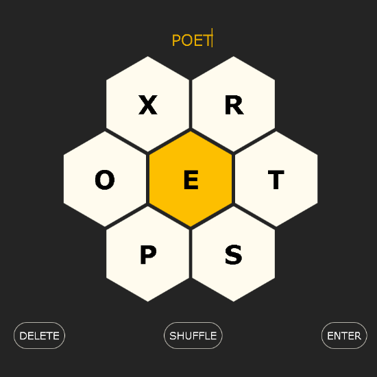

# Hexgame

This is a hexagonal word game where users must create words using a central letter, a game commonly found in newspapers (perhaps most prominent is New York Times Spelling Bee). You must guess words that: include the central letter, are least four letters long, and do not include any letters beyond the seven given letters. You are given points dependent on the quality of your guesses. The hex's letters reset daily with a new challenge.

Available to play online at:

* http://www.swilliams.io/fun/hex
* https://swilliamsio.itch.io/hexgame

## License

CC BY-NC-SA 4.0
